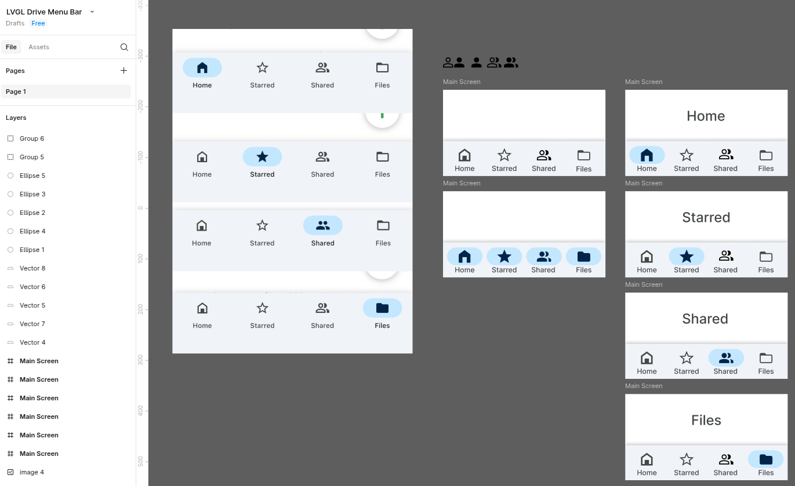

# LVGL Google Drive Menubar

Developed in XML with LVGL Pro and a little bit of custom C code.

Check it out running on ESP32-C6 Waveshare 1.9" Display:
https://www.youtube.com/watch?v=5IYY1xQT7X8

Figma design here: https://www.figma.com/design/LsYuCpgq29DK3f4DmWvySZ/LVGL-Drive-Menu-Bar

